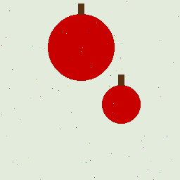

# CV Classify

> A lightweight CLI & Python library for **Azure Custom Vision — Image Classification**.
> Upload an image, get back tag predictions with confidence scores.

---

## Table of Contents

1. [Part A — Azure Portal Setup (pre-requisite)](#part-a--azure-portal-setup)
2. [Part B — Local Project Setup](#part-b--local-project-setup)
3. [Usage](#usage)
4. [Project Structure](#project-structure)
5. [Configuration Reference](#configuration-reference)
6. [Contributing](#contributing)
7. [License](#license)

---

## Part A — Azure Portal Setup

> Complete these steps **once** before using the CLI.
> You need an [Azure subscription](https://azure.microsoft.com/free/).

### 1. Create the Azure Resources

1. Go to the [Azure portal](https://portal.azure.com/) → **Create a resource** → search **Custom Vision**.
2. Create **two** resources (or a single Azure AI Services resource):

   | Resource | What you'll need |
   |----------|-----------------|
   | **Training** | Training endpoint + Training key |
   | **Prediction** | Prediction endpoint + Prediction key + Prediction resource ID |

   > **Tip:** The *Prediction resource ID* is only needed when publishing an iteration programmatically; the portal handles it automatically.

### 2. Create a Classification Project

1. Open the [Custom Vision portal](https://www.customvision.ai/) and sign in.
2. Click **New Project** and fill in:

   | Setting | Value |
   |---------|-------|
   | **Project type** | Classification |
   | **Classification type** | **Multiclass** *(one label per image)* or **Multilabel** *(multiple labels per image)* |
   | **Domain** | General (or a compact domain if you plan to export) |

   > For your first run, pick **Multiclass** — it's simpler and aligns well with the AI-102 exam.

### 3. Upload & Tag Images

This project includes **60 sample images** in the `data/` folder, organised by tag:

| Tag | Folder | Count | Samples |
|-----|--------|-------|---------|
| **apple** | `data/apple/` | 20 |     |
| **banana** | `data/banana/` | 20 |     |
| **orange** | `data/orange/` | 20 |     |

> Upload these images to your Custom Vision project and assign the matching tag to each batch.

   **Rule of thumb for a clean first pass:**

   - **10 images per tag minimum** (more is better)
   - **30–50 images** total across all tags
   - Use diverse angles, lighting, and backgrounds

### 4. Train & Review Precision / Recall

1. Click **Train** (Quick Training is fine for the first pass).
2. Once training completes, open the **Performance** tab and review:
   - **Precision / Recall** per tag
   - Confusion patterns — which tags are getting mixed up?
3. If needed, upload more images for under-performing tags and retrain.

### 5. Publish the Iteration

1. Select the trained iteration and click **Publish**.
2. Give it a name (e.g. `v1`).
3. Choose the **Prediction resource** you created in Step 1.

   > **Key point:** The iteration is **not** available to the Prediction API until it is published.

4. After publishing, go to **Prediction URL** in the portal to find:
   - **Prediction endpoint**
   - **Prediction key**
   - **Project ID** (visible in the project settings URL)
   - **Published iteration name** (the name you chose above)

---

## Part B — Local Project Setup

### Prerequisites

- Python **3.10+**
- An Azure Custom Vision project with a **published iteration** (see [Part A](#part-a--azure-portal-setup))

### 1. Clone the Repository

```bash
git clone https://github.com/<your-org>/cv-classify.git
cd cv-classify
```

### 2. Create a Virtual Environment

```bash
python -m venv .venv
source .venv/bin/activate   # macOS / Linux
# .venv\Scripts\activate    # Windows
```

### 3. Install the Package

```bash
pip install -e .
```

### 4. Configure Environment Variables

Copy the example file and fill in your values from the Custom Vision portal:

```bash
cp .env.example .env
```

Edit `.env`:

```dotenv
CV_PREDICTION_KEY="<your-prediction-key>"
CV_PREDICTION_ENDPOINT="https://<your-resource>.cognitiveservices.azure.com/"
CV_PROJECT_ID="<your-project-id>"
CV_PUBLISH_ITERATION_NAME="v1"
```

Then load the variables before running:

```bash
set -a && source .env && set +a
```

---

## Usage

### CLI

```bash
# Human-readable output
cv-classify path/to/image.jpg

# JSON output
cv-classify path/to/image.jpg --json
```

**Example output:**

```
apple                          0.9842
banana                         0.0091
orange                         0.0067
```

### Python API

```python
from cv_classify.predict import classify_image

results = classify_image("path/to/image.jpg")
for r in results:
    print(f"{r['tag']}: {r['probability']:.2%}")
```

---

## Project Structure

```
cv-classify/
├── pyproject.toml          # Package metadata & dependencies
├── .env.example            # Environment variable template (safe to commit)
├── .gitignore
├── LICENSE
├── README.md
├── data/                   # Sample training images (20 per tag)
│   ├── apple/
│   ├── banana/
│   └── orange/
└── src/
    └── cv_classify/
        ├── __init__.py
        ├── cli.py          # CLI entry-point (argparse)
        ├── config.py       # Reads env vars
        └── predict.py      # Calls the Custom Vision Prediction API
```

---

## Configuration Reference

| Variable | Description |
|----------|-------------|
| `CV_PREDICTION_KEY` | Prediction resource key from the Azure portal |
| `CV_PREDICTION_ENDPOINT` | Prediction resource endpoint URL |
| `CV_PROJECT_ID` | GUID of your Custom Vision project |
| `CV_PUBLISH_ITERATION_NAME` | Name of the published iteration (e.g. `v1`) |

---

## Contributing

1. Fork the repo and create a feature branch.
2. Make your changes and add/update tests.
3. Open a pull request describing your changes.

---

## License

This project is licensed under the [MIT License](LICENSE).
